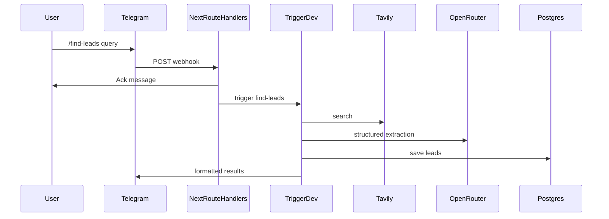

# Lead Generation Agent

Telegram-based AI agent that researches companies, extracts structured lead data, saves results to Postgres, and delivers outreach-ready summaries in chat.

Built for learning modern AI agent patterns: workflow orchestration (Trigger.dev), LLM structured outputs (OpenRouter), research APIs (Tavily), and production deployment (Railway).

## What it does

1. You send a command in Telegram, e.g. `/find-leads SaaS companies in Chennai`
2. The bot acknowledges immediately
3. A background job searches the web (Tavily), extracts leads with an LLM (OpenRouter), saves to the database, and replies with formatted results

## Architecture

| Layer | Technology |
|-------|------------|
| Backend | Next.js Route Handlers |
| Orchestration | Trigger.dev |
| AI models | OpenRouter |
| Messaging | Telegram Bot API |
| Database | Railway Postgres |
| Research | Tavily API |
| Deployment | Railway |



## Prerequisites

- [Node.js](https://nodejs.org/) 20+
- [Telegram BotFather](https://t.me/BotFather) bot token
- [OpenRouter](https://openrouter.ai/) API key
- [Tavily](https://tavily.com/) API key
- [Trigger.dev](https://trigger.dev/) project
- [Railway](https://railway.app/) (or any Postgres) for database + hosting

## Quick start

### 1. Install

```bash
git clone <your-repo-url>
cd lead-generation-agent
npm install
```

### 2. Environment

```bash
cp .env.example .env.local
```

Fill in all values. For local Next.js boot without every key:

```bash
SKIP_ENV_VALIDATION=true
```

Trigger tasks and `/find-leads` still need real `OPENROUTER_API_KEY`, `TAVILY_API_KEY`, `TELEGRAM_BOT_TOKEN`, and `TRIGGER_SECRET_KEY`.

### 3. Database

Apply schema to Postgres:

```bash
# Option A: Drizzle push
npm run db:push

# Option B: SQL migration
psql $DATABASE_URL -f lib/database/migrations/0000_initial.sql
```

### 4. Trigger.dev

1. Create a project at [cloud.trigger.dev](https://cloud.trigger.dev)
2. Link the repo and set `TRIGGER_PROJECT_REF` in `.env.local`
3. Add **DEV** `TRIGGER_SECRET_KEY` from Project → API Keys
4. Run Next.js and the Trigger worker:

```bash
npm run dev:all
```

Or in two terminals:

```bash
npm run dev
npm run trigger:dev
```

Deploy tasks to Trigger.dev cloud:

```bash
npm run trigger:deploy
```

### 5. Telegram webhook

Expose your app (e.g. [ngrok](https://ngrok.com/) locally or Railway in production), then set the webhook:

```bash
curl -X POST "https://api.telegram.org/bot<TELEGRAM_BOT_TOKEN>/setWebhook" \
  -H "Content-Type: application/json" \
  -d "{\"url\":\"https://<your-host>/api/telegram/webhook\",\"secret_token\":\"<TELEGRAM_WEBHOOK_SECRET>\"}"
```

Use the same `TELEGRAM_WEBHOOK_SECRET` in your environment. Telegram sends it as `X-Telegram-Bot-Api-Secret-Token`.

**Helper script** (after ngrok or Railway is running):

```bash
npm run telegram:webhook https://your-public-url
```

This registers `https://your-public-url/api/telegram/webhook`, applies your secret, and clears stuck pending updates.

### Troubleshooting: bot does not reply

1. **Webhook must reach your running app.** If you use ngrok, the tunnel must be online (`npm run dev` + `ngrok http 3000`). Old ngrok URLs return 404 and Telegram will not deliver messages.
2. **Re-register webhook** whenever your public URL changes:
   ```bash
   npm run telegram:webhook https://NEW-URL
   ```
3. **Check Telegram webhook status:**
   ```bash
   node -e "require('dotenv').config(); fetch('https://api.telegram.org/bot'+process.env.TELEGRAM_BOT_TOKEN+'/getWebhookInfo').then(r=>r.json()).then(j=>console.log(j.result?.url, j.result?.last_error_message))"
   ```
4. **Secret token** must match: if `TELEGRAM_WEBHOOK_SECRET` is set in `.env`, the webhook must be registered with the same value (the helper script does this automatically).
5. **Health check:** open `GET https://your-public-url/api/telegram/webhook` — should return JSON `{ ok: true, ... }`.

## Commands

| Command | Description |
|---------|-------------|
| `/find-leads <niche and location>` | Research and return structured leads |
| `/history` | Last 10 saved leads for your Telegram user |
| `/help` | Usage instructions |

Example:

```text
/find-leads AI startups in Chennai
```

Results are delivered as a **CSV file** in Telegram with columns: Company Name, Industry, Location, Website, LinkedIn, Email, Founder Name, AI Summary, Outreach Angle, Lead Score.

## Environment variables

| Variable | Purpose |
|----------|---------|
| `NEXT_PUBLIC_APP_URL` | Public app URL (OpenRouter referer header) |
| `DATABASE_URL` | Postgres connection string |
| `TELEGRAM_BOT_TOKEN` | BotFather token |
| `TELEGRAM_WEBHOOK_SECRET` | Webhook validation secret |
| `OPENROUTER_API_KEY` | LLM API access |
| `OPENROUTER_MODEL` | Model id (default: `openai/gpt-4o-mini`) |
| `TAVILY_API_KEY` | Web research API |
| `TRIGGER_PROJECT_REF` | Trigger.dev project ref |
| `TRIGGER_SECRET_KEY` | Trigger.dev secret (dev/prod per environment) |
| `SKIP_ENV_VALIDATION` | `true` to skip Zod env warnings locally |

## Project structure

```text
app/api/telegram/webhook/   # Telegram ingress
agents/lead-generation/     # Research + LLM orchestration
skills/agent_skill.md         # Agent system instructions
tools/                        # Tavily search, Zod lead schema
lib/ai/                       # OpenRouter client
lib/database/                 # Drizzle schema + lead persistence
lib/telegram/                 # Send + format messages
telegram/commands.ts          # Command parser
trigger/find-leads.ts         # Background workflow task
```

## Deployment (Railway)

1. Push the repo to GitHub
2. Create a Railway project → deploy from GitHub
3. Add the **Postgres** plugin and set `DATABASE_URL`
4. Set all env vars from `.env.example`
5. Build command: `npm run build`
6. Start command: `npm run start`
7. Run `npm run trigger:deploy` from CI or locally with production `TRIGGER_SECRET_KEY`
8. Point Telegram webhook to `https://<railway-domain>/api/telegram/webhook`

## Costs and accuracy

- Tavily and OpenRouter usage incur API costs; cap results in `tools/tavily-search.ts` if needed.
- Emails and social links are only included when present in search snippets — the agent is instructed not to invent contact data.

## Contributing / agent behavior

- [PROTOCOL.md](./PROTOCOL.md) — coding discipline (simplicity, surgical changes, verify each step)
- [AGENTS.md](./AGENTS.md) — MVP scope and conventions for AI assistants

## Roadmap (post-MVP)

- WhatsApp integration
- Dashboard UI
- CRM integrations
- Automated outreach emails
- Multi-agent workflows
- Scheduled lead scraping
- AI lead scoring

## Learning outcomes

- AI agent architecture and skill prompts
- Workflow orchestration with Trigger.dev
- LLM integration and structured JSON outputs
- Third-party API integration (Tavily, Telegram)
- Database persistence with Drizzle
- Production deployment on Railway
